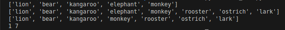
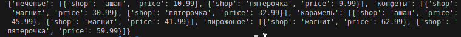

#00_distance 
Цель задания: Составить словарь словарей расстояний между городами и найти расстояние на координатной сетке по формуле ((x1 - x2)**2 + (y1 - y2)**2) ** 0.5

Вывод: Составил словарь словарей расстояний между городами и нашел его на координатной сетке

#01_circle 
Цель задания: Вывести на консоль значение площади круга с точностю до 4-х знаков после запятой и если 2 точки "point" лежат внутри этого круга, то вывести на консоль "True", или "False", если точка лежит вовне круга. 

Вывод: Вывел на консоль значение площади круга с точностю до 4-х знаков после запятой и если 2 точки "point" лежат внутри этого круга, то вывел на консоль "True", или "False", если точка лежит вовне круга.

#02_operations
Цель задания: Расставить знаки операций "плюс", "минус", "умножение" и скобки между числами "1 2 3 4 5" так, что бы получилось число "25" 

Вывод: Расставил знаки операций "плюс", "минус", "умножение" и скобки между числами "1 2 3 4 5" так, что бы получилось число "25"

#03_favorite_movies 
Цель задания: Вывести на консоль с помощью индексации строки, последовательно: первый фильм, последний, второй, второй с конца

image Вывод: Вывел на консоль с помощью индексации строки, последовательно: первый фильм, последний, второй, второй с конца

#04_my_family 
Цель задания: Создать списки: семья, список списков приблизителного роста членов семьи. Вывести на консоль рост отца, Вывести на консоль общий рост семьи 

Вывод: Создал списки: семья, список списков приблизителного роста членов семьи. Вывел на консоль рост отца, Вывел на консоль общий рост семьи

#05_zoo 
Цель задания: Выполнить ряд действий со списком: посадить медведя между львом и кенгуру, добавить птиц из списка "birds" в последние клетки зоопарка, уберать слона, вывести на консоль в какой клетке сидит лев и жаворонок. 

Вывод: Выполнил ряд действий со списком: посадил медведя между львом и кенгуру, добавил птиц из списка "birds" в последние клетки зоопарка, уберал слона, вывел на консоль в какой клетке сидит лев и жаворонок.

#06_songs_list 
Цель задания: Распечатать общее время звучания трех песен: 'Halo', 'Enjoy the Silence' и 'Clean'. Распечатать общее время звучания трех песен: 'Sweetest Perfection', 'Policy of Truth' и 'Blue Dress' 

Вывод: Распечатал общее время звучания трех песен: 'Halo', 'Enjoy the Silence' и 'Clean'. Распечатал общее время звучания трех песен: 'Sweetest Perfection', 'Policy of Truth' и 'Blue Dress'

#07_secret 
Цель задания: Расшифровать зашифрованное сообщение и вывести на консоль в удобочитаемом виде. 

Вывод: Расшифровать зашифрованное сообщение и вывести на консоль в удобочитаемом виде.

#08_garden 
Цель задания: Создать множество цветов, произрастающих в саду и на лугу и провести ряд выводов 

Вывод: Создал множество цветов, произрастающих в саду и на лугу и провел ряд выводов

#09_shopping 
Цель задания: Создать словарь цен на продкты 

Вывод: Создал словарь цен на продкты

#10_store 
Цель задание: Вывести стоимость каждого вида товара на складе 

Вывод: Вывел стоимость каждого вида товара на складе

Список комманд git: 

git push - выполняет отправку недавних коммитов c компьютера локального репозитория на сервер с удаленным репозиторием 

git clone - Клонирование репозитория в новый каталог 

git commit - Запись изменений в репозиторий 

git add - Добавить содержимое файла в индекс 

git pull - Взять из репозитория обновленные данные
