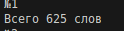
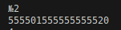
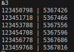

Цель: Рассматриваются символьные последовательности длины 6  в пятибуквенном алфавите {К, А, Т, Е, Р}. Сколько существует таких последовательностей, которые начинаются с буквы Р и заканчиваются буквой К?
Результат:

Цель: Значение выражения 
216^6+216^4+36^6−6^14−24 записали в системе счисления с основанием 6. Сколько различных цифр содержит эта запись?
Результат:

Цель: Назовём маской числа последовательность цифр, в которой также могут встречаться следующие символы:
символ ? означает ровно одну произвольную цифру;
символ * означает любую последовательность цифр произвольной длины; в том числе * может задавать и пустую последовательность.
Например, маске 123*4?5 соответствуют числа 123405 и 12365485.
Среди натуральных чисел, не превышающих 10^9, найдите все числа, соответствующие маске 12345? 7?8, делящиеся на число 23 без остатка.

Запишите в первом столбце таблицы все найденные числа в порядке возрастания, а во втором столбце  — соответствующие им результаты деления этих чисел на 23.
Результат:

Ссылки на используемые материалы:
https://habr.com/ru/companies/otus/articles/529356/

https://proglib.io/p/iteriruemsya-pravilno-20-priemov-ispolzovaniya-v-python-modulya-itertools-2020-01-03

https://www.geeksforgeeks.org/python/python-itertools/