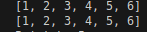
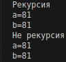

Цель: Создать функцию для линеаризации вложенных списков

Результат:

Цель: Создать функцию для расчёта a(k)= 2b(k-1)+ a(k-1); b(k)=2a(k-1)+b(k-1). a(1)=b(1)=1

Результат:

Список используемых источников:

https://proglib.io/p/samouchitel-po-python-dlya-nachinayushchih-chast-13-rekursivnye-funkcii-2023-01-23

https://habr.com/ru/articles/337030/

https://pytest.org/

