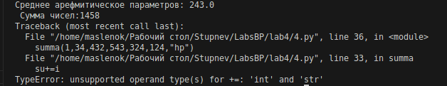
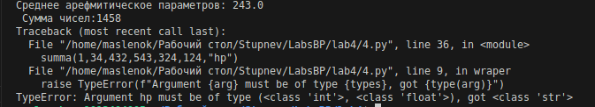

Цель: Замыкание для поиска среднего в аргументах. Декоратор для проверки аргументов функции на тип и диапазон значений.
Замыкание для записи всех значений в файл.

Код:

```python
  
from functools import wraps
def check(types= None, mi_v = None, ma_v=None):
    def chec_d(func: callable)-> callable:
        @wraps(func)
        def wraper(*args,**kwargs):
            if types is not None:
                for arg in args:
                    if not isinstance(arg,types):
                       raise TypeError(f"Argument {arg} must be of type {types}, got {type(arg)}")
            if mi_v is not None or ma_v is not None:
                for arg in args:
                    if not isinstance(arg, (int, float)):
                        continue
                    if mi_v is not None and arg < mi_v:
                        raise ValueError(f"Argument {arg} is less than {mi_v}")
                    if ma_v is not None and arg > ma_v:
                        raise ValueError(f"Argument {arg} is greater than {ma_v}")
            return func(*args, **kwargs)
        return wraper
    return chec_d
@check(types = (int, float),mi_v=0, ma_v=600)
def summa(*args):
    def wraper(*args):
        s=0
        k=0
        for i in  args:
            s+=i
            k+=1
        print(f'Среднее арефмитическое параметров: {s/k}\n Сумма чисел:{su}')

    su=0
    for i in args:
        su+=i
    return  wraper(*args)
summa(1,34,432,543,324,124)
summa(1,34,432,543,324,124,"hp")

```

Без декоратора:



С декоратором:



 Список использованных источников:

 [Замыкания и декораторы в Python: часть 1 — замыкания](https://habr.com/ru/articles/781866/)
 
 [Замыкания и Декораторы](https://pyhub.ru/python-advanced/lecture-10-33-71/)
 
 [Декораторы Python: пошаговое руководство](https://habr.com/ru/companies/otus/articles/727590/)
 
