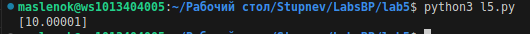

Задание: Генератор, применяющий заданную функцию к каждому элементу последовательности N раз. Верните только те элементы, которые изменились значительно (зависит от N и типа данных).

Код:
```python
import pytest
from functools import reduce
from typing import Iterable, Callable, Any, Optional

def significant_changes(
    iterable: Iterable[Any],
    func: Callable[[Any], Any],
    n: int,
    significance_func: Optional[Callable[[Any, Any, int], bool]] = None
):
    """
    Генератор, который применяет функцию func к каждому элементу последовательности
    n раз и возвращает только те результаты, которые значительно изменились.

    :param iterable: исходная последовательность
    :param func: функция, применяемая к элементу
    :param n: количество применений
    :param significance_func: функция, определяющая значительность изменения.
                              Принимает (old_value, new_value, n) и возвращает bool.
                              Если не задана, используется встроенная логика для чисел и строк.
    :yield: изменённые элементы, прошедшие фильтр значительности
    """
    if significance_func is None:
        def significance_func(old: Any, new: Any, n: int) -> bool:
            
            if isinstance(old, (int, float)):
                
                return abs(new - old) > n * 1e-6
            elif isinstance(old, str):
                
                return abs(len(new) - len(old)) > n
            else:
                
                return new != old

   
    def apply_n_times(x: Any) -> Any:
        return reduce(lambda val, _: func(val), range(n), x)

    
    mapped = map(lambda x: (x, apply_n_times(x)), iterable)

    filtered = filter(lambda pair: significance_func(pair[0], pair[1], n), mapped)

    for _, new_value in filtered:
        yield new_value

# ------------------- Тесты pytest -------------------

def test_numbers_significant_change():
    
    result = list(significant_changes(
        [1, 2, 3],
        lambda x: x + 1,
        1,
        lambda old, new, _: new - old > 0.5
    ))
    assert result == [2, 3, 4]


def test_numbers_insignificant_change():
    
    result = list(significant_changes(
        [1, 2, 3],
        lambda x: x + 0.1,
        1,
        lambda old, new, _: new - old > 0.5
    ))
    assert result == []


def test_multiple_applications():
    
    result = list(significant_changes(
        [1, 2, 3],
        lambda x: x * 2,
        2,
        lambda old, new, _: abs(new - old) > 2
    ))
    assert result == [4, 8, 12]


def test_strings_length_change():
    
    result = list(significant_changes(
        ["x", "ab", "xyz"],
        lambda s: s + 'a',
        3,
        lambda old, new, _: abs(len(new) - len(old)) > 2
    ))
    assert result == ["xaaa", "abaaa", "xyzaaa"]


def test_strings_no_change():
    
    result = list(significant_changes(
        ["abc", "def", "g"],
        lambda s: s[0] if s else s,
        1,
        lambda old, new, _: new != old
    ))
    assert result == ["a", "d"]


def test_default_significance_for_numbers():
    
    result = list(significant_changes([10.0], lambda x: x + 1e-5, 1))
    assert result == [10.00001]

    
    result = list(significant_changes([10.0], lambda x: x + 1e-7, 1))
    assert result == []


def test_default_significance_for_strings():
    
    result = list(significant_changes(["hello"], lambda s: s + 'aa', 2))
    assert result == []  

    result = list(significant_changes(["hello"], lambda s: s + 'aaa', 2))
    assert result == ["helloaaa"]


def test_generator_lazyness():
    
    def gen():
        for i in range(5):
            yield i

    result_gen = significant_changes(gen(), lambda x: x + 1, 1, lambda o, n, _: n - o > 0)
    
    assert next(result_gen) == 1
    assert next(result_gen) == 2

```

Реализована генераторная функция significant_changes, которая к каждому элементу входной последовательности применяет заданную функцию n раз и возвращает только те результаты, чьё изменение признано значительным. Для многократного применения используется reduce с лямбдой, осуществляющей n последовательных вызовов func. Фильтрация выполняется через пользовательскую функцию significance_func (принимает старое значение, новое значение и n), а при её отсутствии — встроенная логика: для чисел разница сравнивается с порогом n * 1e-6, для строк — разница длин с порогом n, для остальных типов — простое неравенство. Генератор ленив: значения вычисляются и отбираются по одному, не загружая всю последовательность в память, что подтверждено тестами с пошаговым извлечением через next. Тесты pytest проверяют значимые и незначимые изменения для чисел и строк, множественные применения, ленивость и работу встроенной функции значимости по умолчанию.

Результат:



Список использованной источников:

[Генераторы в Python](https://habr.com/ru/articles/866616/)

[Что такое yield в Python и как его использовать](https://thecode.media/yield-v-python/)

[Генераторы Python: что это такое и зачем они нужны](https://practicum.yandex.ru/blog/chto-takoe-generator-v-python-i-dlya-chego-nuzhen/)