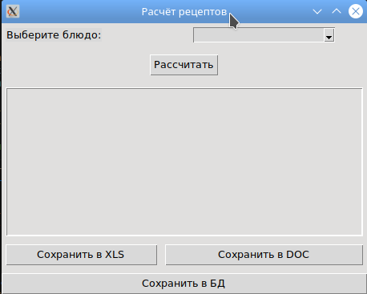

Цель: По своему варианту задания создайте пакет, содержащий 3 модуля, и подключите его к основной программе.

Разработано приложение на Python для расчёта энергетической ценности и стоимости блюд (Вок, Бургер, Пицца) с графическим интерфейсом на Tkinter. Создан пакет recipe_package из трёх модулей: ingredients (база продуктов), calculator (логика вычислений) и report (экспорт результатов). Реализован функционал сохранения отчётов в форматы .docx и .xlsx с помощью библиотек python-docx и openpyxl. Добавлена возможность записи результатов расчётов в базу данных PostgreSQL, развёрнутую в Docker-контейнере. Приложение успешно вычисляет калорийность, содержание белков, жиров, углеводов и итоговую стоимость для выбранного рецепта.

Код:
```python
# main.py
import tkinter as tk
from tkinter import ttk, messagebox, filedialog
from recipe.calculator import RECIPES, calculate
from recipe.report import save_to_xls, save_to_doc
import psycopg2

# ---------- Настройки БД (PostgreSQL в Docker) ----------
DB_CONFIG = {
    "dbname": "recipes_db",
    "user": "postgres",
    "password": "postgres",
    "host": "localhost",
    "port": 5432
}

def save_to_db(results):
    try:
        conn = psycopg2.connect(**DB_CONFIG)
        cur = conn.cursor()
        cur.execute("""
            CREATE TABLE IF NOT EXISTS results (
                id SERIAL PRIMARY KEY,
                recipe TEXT,
                kcal REAL,
                protein REAL,
                fat REAL,
                carbs REAL,
                price REAL,
                created_at TIMESTAMP DEFAULT CURRENT_TIMESTAMP
            )
        """)
        cur.execute("""
            INSERT INTO results (recipe, kcal, protein, fat, carbs, price)
            VALUES (%s, %s, %s, %s, %s, %s)
        """, (
            results["recipe"],
            results["kcal"],
            results["protein"],
            results["fat"],
            results["carbs"],
            results["price"]
        ))
        conn.commit()
        cur.close()
        conn.close()
        return True
    except Exception as e:
        messagebox.showerror("Ошибка БД", str(e))
        return False

# ---------- Графический интерфейс ----------
class RecipeApp:
    def __init__(self, root):
        self.root = root
        self.root.title("Расчёт рецептов")
        self.current_result = None

        # Выбор рецепта
        ttk.Label(root, text="Выберите блюдо:").grid(row=0, column=0, padx=5, pady=5, sticky="w")
        self.recipe_var = tk.StringVar()
        self.recipe_combo = ttk.Combobox(root, textvariable=self.recipe_var,
                                         values=list(RECIPES.keys()), state="readonly")
        self.recipe_combo.grid(row=0, column=1, padx=5, pady=5)

        # Кнопка расчёта
        ttk.Button(root, text="Рассчитать", command=self.calculate).grid(row=1, column=0, columnspan=2, pady=10)

        # Текстовое поле для вывода результата
        self.result_text = tk.Text(root, height=12, width=55, state="disabled")
        self.result_text.grid(row=2, column=0, columnspan=2, padx=5, pady=5)

        # Кнопки экспорта
        ttk.Button(root, text="Сохранить в XLS", command=self.export_xls).grid(row=3, column=0, padx=5, pady=5, sticky="ew")
        ttk.Button(root, text="Сохранить в DOC", command=self.export_doc).grid(row=3, column=1, padx=5, pady=5, sticky="ew")

        # Сохранение в БД
        ttk.Button(root, text="Сохранить в БД", command=self.save_db).grid(row=4, column=0, columnspan=2, pady=5, sticky="ew")

    def calculate(self):
        recipe = self.recipe_var.get()
        if not recipe:
            messagebox.showwarning("Внимание", "Выберите блюдо из списка")
            return
        try:
            # Здесь можно было бы добавить окно для изменения количеств, но пока используем стандартные
            self.current_result = calculate(recipe)
            self.display_result()
        except Exception as e:
            messagebox.showerror("Ошибка расчёта", str(e))

    def display_result(self):
        res = self.current_result
        text = f"Блюдо: {res['recipe']}\n"
        text += f"Калории: {res['kcal']} ккал\n"
        text += f"Белки: {res['protein']} г, Жиры: {res['fat']} г, Углеводы: {res['carbs']} г\n"
        text += f"Стоимость: {res['price']} руб.\n\nСостав:\n"
        for ing, (grams, kcal, price) in res["breakdown"].items():
            text += f"  {ing}: {grams} г, {kcal:.1f} ккал, {price:.2f} руб.\n"
        self.result_text.config(state="normal")
        self.result_text.delete(1.0, tk.END)
        self.result_text.insert(tk.END, text)
        self.result_text.config(state="disabled")

    def export_xls(self):
        if not self.current_result:
            messagebox.showwarning("Нет данных", "Сначала выполните расчёт")
            return
        filepath = filedialog.asksaveasfilename(defaultextension=".xlsx",
                                                filetypes=[("Excel files", "*.xlsx")])
        if filepath:
            try:
                save_to_xls(self.current_result, filepath)
                messagebox.showinfo("Готово", f"Отчёт сохранён в {filepath}")
            except Exception as e:
                messagebox.showerror("Ошибка", f"Не удалось сохранить файл:\n{e}")

    def export_doc(self):
        if not self.current_result:
            messagebox.showwarning("Нет данных", "Сначала выполните расчёт")
            return
        filepath = filedialog.asksaveasfilename(defaultextension=".docx",
                                                filetypes=[("Word files", "*.docx")])
        if filepath:
            try:
                save_to_doc(self.current_result, filepath)
                messagebox.showinfo("Готово", f"Отчёт сохранён в {filepath}")
            except Exception as e:
                messagebox.showerror("Ошибка", f"Не удалось сохранить файл:\n{e}")

    def save_db(self):
        if not self.current_result:
            messagebox.showwarning("Нет данных", "Сначала выполните расчёт")
            return
        if save_to_db(self.current_result):
            messagebox.showinfo("БД", "Результат сохранён в базу данных")

if __name__ == "__main__":
    root = tk.Tk()
    app = RecipeApp(root)
    root.mainloop()
```

Результат:



Список литературы:

[Python модули и пакеты](https://habr.com/ru/articles/718828/)

[Модули в Python](https://python-academy.org/ru/guide/modules)

[Модули и пакеты Python: структурирование кода для разработчиков](https://sky.pro/wiki/python/moduli-i-pakety-v-python-import-i-organizaciya-koda/)