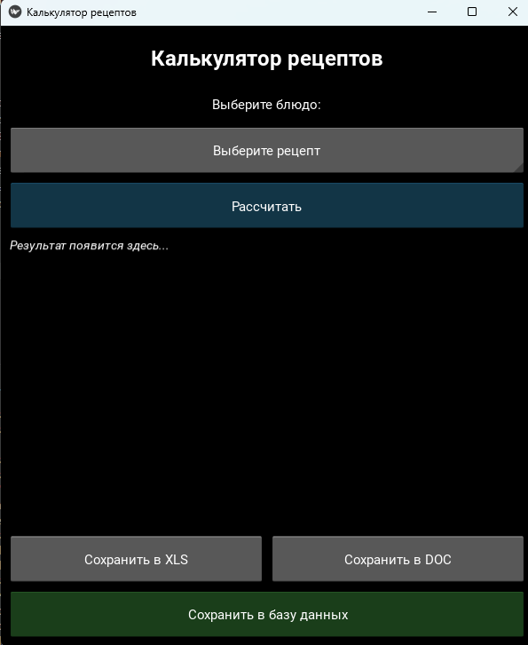

Цель: Перепишите свой вариант ЛР №6 с использованием классов и объектов. Задание то же, вариант GUI фреймворка возьмите следующий по списку. Для успешной сдачи в коде должны присутствовать:

использование абстрактного базового класса и соотвествующих декораторов для методов,

иерархия наследования,

managed - атрибуты,

минимум 2 dunder-метода у каждого класса.
Код:

```python

from abc import ABC, abstractmethod
from dataclasses import dataclass
from typing import Dict, List, Optional
import sqlite3
import openpyxl
from docx import Document
from kivy.app import App
from kivy.uix.boxlayout import BoxLayout
from kivy.uix.label import Label
from kivy.uix.button import Button
from kivy.uix.spinner import Spinner
from kivy.uix.scrollview import ScrollView
from kivy.uix.popup import Popup
from kivy.uix.filechooser import FileChooserListView
from kivy.core.window import Window

Window.size = (600, 700)


# ========== Value Object ==========
@dataclass
class NutritionalValue:
    """Value object для пищевой ценности"""
    kcal: float
    protein: float
    fat: float
    carbs: float
    
    def __add__(self, other: 'NutritionalValue') -> 'NutritionalValue':
        return NutritionalValue(
            kcal=self.kcal + other.kcal,
            protein=self.protein + other.protein,
            fat=self.fat + other.fat,
            carbs=self.carbs + other.carbs
        )
    
    def __mul__(self, factor: float) -> 'NutritionalValue':
        return NutritionalValue(
            kcal=self.kcal * factor,
            protein=self.protein * factor,
            fat=self.fat * factor,
            carbs=self.carbs * factor
        )
    
    def __repr__(self) -> str:
        return f"NV(kcal={self.kcal:.1f})"


# ========== Ingredient Classes ==========
class Ingredient:
    """Класс ингредиента с managed-атрибутами"""
    
    def __init__(self, name: str, protein: float, fat: float, 
                 carbs: float, kcal: float, price_per_100g: float):
        self._name = name
        self._protein = protein
        self._fat = fat
        self._carbs = carbs
        self._kcal = kcal
        self._price_per_100g = price_per_100g
    
    @property
    def name(self) -> str:
        return self._name
    
    @property
    def nutritional_value(self) -> NutritionalValue:
        return NutritionalValue(self._kcal, self._protein, self._fat, self._carbs)
    
    @property
    def price_per_100g(self) -> float:
        return self._price_per_100g
    
    @price_per_100g.setter
    def price_per_100g(self, value: float):
        if value < 0:
            raise ValueError("Цена не может быть отрицательной")
        self._price_per_100g = value
    
    def calculate_for_weight(self, grams: float) -> 'IngredientPortion':
        factor = grams / 100.0
        return IngredientPortion(
            ingredient=self,
            grams=grams,
            nutritional_value=self.nutritional_value * factor,
            price=self.price_per_100g * factor
        )
    
    def __str__(self) -> str:
        return f"{self._name} (₽{self._price_per_100g:.2f}/100г)"
    
    def __repr__(self) -> str:
        return f"Ingredient('{self._name}')"


class IngredientPortion:
    """Порция ингредиента в рецепте"""
    
    def __init__(self, ingredient: Ingredient, grams: float, 
                 nutritional_value: NutritionalValue, price: float):
        self.ingredient = ingredient
        self.grams = grams
        self.nutritional_value = nutritional_value
        self.price = price
    
    def __str__(self) -> str:
        return f"{self.ingredient.name}: {self.grams}г, {self.nutritional_value.kcal:.0f}ккал, ₽{self.price:.2f}"
    
    def __add__(self, other: 'IngredientPortion') -> NutritionalValue:
        return self.nutritional_value + other.nutritional_value


class RecipeResult:
    """Результат расчёта рецепта"""
    
    def __init__(self, name: str, portions: List[IngredientPortion]):
        self.name = name
        self.portions = portions
        self._total = None
    
    @property
    def total_nutrition(self) -> NutritionalValue:
        if self._total is None:
            self._total = sum((p.nutritional_value for p in self.portions), 
                             NutritionalValue(0, 0, 0, 0))
        return self._total
    
    @property
    def total_price(self) -> float:
        return sum(p.price for p in self.portions)
    
    @property
    def breakdown(self) -> Dict[str, tuple]:
        return {p.ingredient.name: (p.grams, p.nutritional_value.kcal, p.price) 
                for p in self.portions}
    
    def __getitem__(self, key: str) -> Optional[IngredientPortion]:
        for p in self.portions:
            if p.ingredient.name == key:
                return p
        return None
    
    def __len__(self) -> int:
        return len(self.portions)
    
    def __str__(self) -> str:
        lines = [f"Блюдо: {self.name}",
                 f"Калории: {self.total_nutrition.kcal:.1f} ккал",
                 f"Белки/Жиры/Углеводы: {self.total_nutrition.protein:.1f}/{self.total_nutrition.fat:.1f}/{self.total_nutrition.carbs:.1f} г",
                 f"Стоимость: {self.total_price:.2f} руб."]
        return "\n".join(lines)
    
    def to_text(self) -> str:
        """Форматированный вывод для GUI"""
        text = f"[b]{self.name}[/b]\n\n"
        text += f"Энергетическая ценность:\n"
        text += f"   Калории: {self.total_nutrition.kcal:.1f} ккал\n"
        text += f"   Белки: {self.total_nutrition.protein:.1f} г\n"
        text += f"   Жиры: {self.total_nutrition.fat:.1f} г\n"
        text += f"   Углеводы: {self.total_nutrition.carbs:.1f} г\n\n"
        text += f"Стоимость: {self.total_price:.2f} руб.\n\n"
        text += f"Состав:\n"
        for ing, (grams, kcal, price) in self.breakdown.items():
            text += f"   • {ing}: {grams} г, {kcal:.1f} ккал, {price:.2f} руб.\n"
        return text


# ========== Calculator ==========
class RecipeCalculator:
    """Калькулятор рецептов"""
    
    def __init__(self, ingredients_db: Dict[str, Ingredient]):
        self._ingredients = ingredients_db
        self._recipes: Dict[str, Dict[str, float]] = {}
    
    def add_recipe(self, name: str, ingredients: Dict[str, float]):
        self._recipes[name] = ingredients
    
    def calculate(self, recipe_name: str, custom_weights: Optional[Dict[str, float]] = None) -> RecipeResult:
        if recipe_name not in self._recipes:
            raise ValueError(f"Рецепт '{recipe_name}' не найден")
        
        portions = []
        base_recipe = self._recipes[recipe_name]
        weights = custom_weights or base_recipe
        
        for ing_name, grams in weights.items():
            if ing_name not in self._ingredients:
                continue
            ingredient = self._ingredients[ing_name]
            portions.append(ingredient.calculate_for_weight(grams))
        
        return RecipeResult(recipe_name, portions)
    
    @property
    def recipes(self) -> list:
        return list(self._recipes.keys())
    
    def __contains__(self, recipe_name: str) -> bool:
        return recipe_name in self._recipes
    
    def __iter__(self):
        return iter(self._recipes.items())


# ========== Database Repository ==========
class DatabaseRepository(ABC):
    
    @abstractmethod
    def save_result(self, result: RecipeResult) -> bool:
        pass
    
    @abstractmethod
    def get_all_results(self) -> list:
        pass


class SQLiteRepository(DatabaseRepository):
    """Реализация для SQLite"""
    
    def __init__(self, db_path: str = "recipes.db"):
        self.db_path = db_path
        self._init_table()
    
    def _get_connection(self):
        return sqlite3.connect(self.db_path)
    
    def _init_table(self):
        with self._get_connection() as conn:
            cursor = conn.cursor()
            cursor.execute("""
                CREATE TABLE IF NOT EXISTS results (
                    id INTEGER PRIMARY KEY AUTOINCREMENT,
                    recipe TEXT,
                    kcal REAL,
                    protein REAL,
                    fat REAL,
                    carbs REAL,
                    price REAL,
                    created_at TIMESTAMP DEFAULT CURRENT_TIMESTAMP
                )
            """)
            conn.commit()
    
    def save_result(self, result: RecipeResult) -> bool:
        try:
            with self._get_connection() as conn:
                cursor = conn.cursor()
                cursor.execute("""
                    INSERT INTO results (recipe, kcal, protein, fat, carbs, price)
                    VALUES (?, ?, ?, ?, ?, ?)
                """, (
                    result.name,
                    result.total_nutrition.kcal,
                    result.total_nutrition.protein,
                    result.total_nutrition.fat,
                    result.total_nutrition.carbs,
                    result.total_price
                ))
                conn.commit()
                return True
        except Exception as e:
            print(f"DB Error: {e}")
            return False
    
    def get_all_results(self) -> list:
        with self._get_connection() as conn:
            conn.row_factory = sqlite3.Row
            cursor = conn.cursor()
            cursor.execute("SELECT * FROM results ORDER BY created_at DESC")
            return [dict(row) for row in cursor.fetchall()]
    
    def __enter__(self):
        return self
    
    def __exit__(self, exc_type, exc_val, exc_tb):
        pass


# ========== Exporters ==========
class ReportExporter(ABC):
    
    @abstractmethod
    def export(self, result: RecipeResult, filepath: str) -> None:
        pass


class ExcelExporter(ReportExporter):
    
    def export(self, result: RecipeResult, filepath: str) -> None:
        wb = openpyxl.Workbook()
        
        ws = wb.active
        ws.title = "Результаты"
        ws.append(["Рецепт", "Ккал", "Белки", "Жиры", "Углеводы", "Стоимость (руб)"])
        ws.append([
            result.name,
            result.total_nutrition.kcal,
            result.total_nutrition.protein,
            result.total_nutrition.fat,
            result.total_nutrition.carbs,
            result.total_price
        ])
        
        ws2 = wb.create_sheet("Ингредиенты")
        ws2.append(["Ингредиент", "Грамм", "Ккал", "Цена (руб)"])
        for ing, (grams, kcal, price) in result.breakdown.items():
            ws2.append([ing, grams, kcal, price])
        
        wb.save(filepath)
    
    def __str__(self) -> str:
        return "Excel Exporter"
    
    def __repr__(self) -> str:
        return "ExcelExporter()"


class WordExporter(ReportExporter):
    
    def export(self, result: RecipeResult, filepath: str) -> None:
        doc = Document()
        doc.add_heading('Отчёт по рецепту', level=1)
        doc.add_paragraph(f'Блюдо: {result.name}')
        doc.add_paragraph(f'Энергетическая ценность: {result.total_nutrition.kcal} ккал')
        
        p = doc.add_paragraph()
        p.add_run('Белки: ').bold = True
        p.add_run(f'{result.total_nutrition.protein} г, ')
        p.add_run('Жиры: ').bold = True
        p.add_run(f'{result.total_nutrition.fat} г, ')
        p.add_run('Углеводы: ').bold = True
        p.add_run(f'{result.total_nutrition.carbs} г')
        
        doc.add_paragraph(f'Стоимость: {result.total_price} руб.')
        doc.add_heading('Состав:', level=2)
        
        for ing, (grams, kcal, price) in result.breakdown.items():
            doc.add_paragraph(f'{ing}: {grams} г, {kcal:.1f} ккал, {price:.2f} руб.')
        
        doc.save(filepath)
    
    def __len__(self) -> int:
        return 1
    
    def __call__(self, result: RecipeResult, filepath: str) -> None:
        self.export(result, filepath)


# ========== Kivy GUI ==========
class RecipeAppLayout(BoxLayout):
    """Основной layout приложения на Kivy"""
    
    def __init__(self, calculator: RecipeCalculator, db_repo: SQLiteRepository, **kwargs):
        self.calculator = calculator
        self.db_repo = db_repo
        self.current_result: Optional[RecipeResult] = None
        self.exporters = {
            'xls': ExcelExporter(),
            'doc': WordExporter()
        }
        
        
        super().__init__(**kwargs)
        
        
        self.orientation = 'vertical'
        self.padding = 10
        self.spacing = 10
        
        self._build_ui()
    
    def _build_ui(self):
        """Построение интерфейса"""
        
        title = Label(
            text="[size=24][b]Калькулятор рецептов[/b][/size]",
            markup=True,
            size_hint_y=0.08
        )
        self.add_widget(title)
        
        self.add_widget(Label(text="Выберите блюдо:", size_hint_y=0.05))
        self.recipe_spinner = Spinner(
            text="Выберите рецепт",
            values=self.calculator.recipes,
            size_hint_y=0.08
        )
        self.add_widget(self.recipe_spinner)
        
        self.calc_btn = Button(
            text="Рассчитать",
            size_hint_y=0.08,
            background_color=(0.2, 0.6, 0.8, 1)
        )
        self.calc_btn.bind(on_press=self._calculate)
        self.add_widget(self.calc_btn)
        
        scroll = ScrollView(size_hint_y=0.5)
        self.result_label = Label(
            text="[i]Результат появится здесь...[/i]",
            markup=True,
            size_hint_y=None,
            halign='left',
            valign='top',
            font_size= '14sp'
        )
        self.result_label.bind(
            width = lambda *x: self.result_label.setter('text_size')(self.result_label, (self.result_label.width, None)),
            texture_size= lambda *x: self.result_label.setter('height')(self.result_label, self.result_label.texture_size[1])
        )
        scroll.add_widget(self.result_label)
        self.add_widget(scroll)
        
        btn_layout = BoxLayout(orientation='horizontal', size_hint_y=0.08, spacing=10)
        
        self.xls_btn = Button(text="Сохранить в XLS")
        self.xls_btn.bind(on_press=self._export_xls)
        btn_layout.add_widget(self.xls_btn)
        
        self.doc_btn = Button(text="Сохранить в DOC")
        self.doc_btn.bind(on_press=self._export_doc)
        btn_layout.add_widget(self.doc_btn)
        
        self.add_widget(btn_layout)
        
        self.db_btn = Button(
            text=" Сохранить в базу данных",
            size_hint_y=0.08,
            background_color=(0.3, 0.7, 0.3, 1)
        )
        self.db_btn.bind(on_press=self._save_to_db)
        self.add_widget(self.db_btn)
    
    def _calculate(self, instance):
        """Обработчик расчёта"""
        recipe = self.recipe_spinner.text
        if recipe == "Выберите рецепт":
            self._show_popup("Ошибка", "Пожалуйста, выберите блюдо из списка")
            return
        
        try:
            self.current_result = self.calculator.calculate(recipe)
            self.result_label.text = self.current_result.to_text()
            self.result_label.markup = True
        except Exception as e:
            self._show_popup("Ошибка расчёта", str(e))
    
    def _export_xls(self, instance):
        self._export('xls', "*.xlsx")
    
    def _export_doc(self, instance):
        self._export('doc', "*.docx")
    
    def _export(self, format_type: str, extension: str):
        if not self.current_result:
            self._show_popup("Нет данных", "Сначала выполните расчёт")
            return
        
        content = BoxLayout(orientation='vertical')
        filechooser = FileChooserListView()
        content.add_widget(filechooser)
        
        btn_layout = BoxLayout(size_hint_y=0.2, spacing=10)
        save_btn = Button(text="Сохранить")
        cancel_btn = Button(text="Отмена")
        btn_layout.add_widget(save_btn)
        btn_layout.add_widget(cancel_btn)
        content.add_widget(btn_layout)
        
        popup = Popup(title="Сохранить отчёт", content=content, size_hint=(0.9, 0.9))
        
        def on_save(instance):
            if filechooser.selection:
                filepath = filechooser.selection[0]
                if not filepath.endswith(extension.replace('*', '')):
                    filepath += extension.replace('*', '')
                try:
                    exporter = self.exporters[format_type]
                    exporter.export(self.current_result, filepath)
                    popup.dismiss()
                    self._show_popup("Готово", f"Отчёт сохранён в {filepath}")
                except Exception as e:
                    popup.dismiss()
                    self._show_popup("Ошибка", f"Не удалось сохранить файл:\n{e}")
        
        save_btn.bind(on_press=on_save)
        cancel_btn.bind(on_press=lambda x: popup.dismiss())
        popup.open()
    
    def _save_to_db(self, instance):
        if not self.current_result:
            self._show_popup("Нет данных", "Сначала выполните расчёт")
            return
        
        if self.db_repo.save_result(self.current_result):
            self._show_popup("БД", "Результат сохранён в базу данных")
    
    def _show_popup(self, title: str, message: str):
        """Показать всплывающее сообщение"""
        content = BoxLayout(orientation='vertical')
        content.add_widget(Label(text=message, markup=True))
        close_btn = Button(text="OK", size_hint_y=0.3)
        content.add_widget(close_btn)
        
        popup = Popup(title=title, content=content, size_hint=(0.7, 0.3))
        close_btn.bind(on_press=popup.dismiss)
        popup.open()
    
    def __str__(self) -> str:
        return f"RecipeAppLayout(recipes={len(self.calculator.recipes) if hasattr(self, 'calculator') else 0})"
    
    def __repr__(self) -> str:
        return "RecipeAppLayout()"


class RecipeApp(App):
    """Главный класс приложения Kivy"""
    
    def __init__(self, calculator: RecipeCalculator, db_repo: SQLiteRepository, **kwargs):
        super().__init__(**kwargs)
        self.calculator = calculator
        self.db_repo = db_repo
    
    def build(self):
        self.title = "Калькулятор рецептов"
        return RecipeAppLayout(self.calculator, self.db_repo)
    
    def __str__(self) -> str:
        return "RecipeApp(Kivy)"
    
    def __repr__(self) -> str:
        return "RecipeApp()"


# ========== Инициализация данных ==========
def create_default_ingredients() -> Dict[str, Ingredient]:
    """Создание базы ингредиентов"""
    ingredients_data = {
        "куриное филе":    (23.0, 1.5, 0.0, 110, 45.0),
        "говядина":        (26.0, 15.0, 0.0, 250, 70.0),
        "рис":             (2.7, 0.3, 28.0, 130, 12.0),
        "помидор":         (0.9, 0.2, 3.9, 18, 20.0),
        "сыр":             (25.0, 30.0, 0.0, 350, 80.0),
        "тесто для пиццы": (8.0, 4.0, 45.0, 260, 25.0),
        "кетчуп":          (1.0, 0.1, 25.0, 100, 15.0),
        "салат":           (1.5, 0.2, 2.0, 15, 30.0),
        "булочка":         (9.0, 3.0, 50.0, 270, 18.0),
        "огурец":          (0.7, 0.1, 2.0, 13, 18.0),
    }
    
    ingredients = {}
    for name, (prot, fat, carbs, kcal, price) in ingredients_data.items():
        ingredients[name] = Ingredient(name, prot, fat, carbs, kcal, price)
    return ingredients


def create_default_recipes(calculator: RecipeCalculator):
    """Добавление стандартных рецептов"""
    recipes = {
        "Вок": {"рис": 150, "куриное филе": 100, "помидор": 50, "огурец": 50, "кетчуп": 30},
        "Бургер": {"булочка": 60, "говядина": 120, "сыр": 30, "салат": 20, "помидор": 30, "кетчуп": 20},
        "Пицца": {"тесто для пиццы": 200, "сыр": 100, "помидор": 80, "куриное филе": 70},
    }
    
    for name, ingrs in recipes.items():
        calculator.add_recipe(name, ingrs)


# ========== ТОЧКА ВХОДА ==========
if __name__ == "__main__":
    ingredients = create_default_ingredients()
    calculator = RecipeCalculator(ingredients)
    create_default_recipes(calculator)
    
    db_repo = SQLiteRepository("recipes.db")
    
    app = RecipeApp(calculator, db_repo)
    app.run()
```

В ходе работы разработано объектно-ориентированное приложение на Python с графическим интерфейсом Kivy для расчета калорийности, БЖУ и стоимости рецептов. Реализована иерархия классов с использованием абстрактного базового класса DatabaseRepository и его наследника SQLiteRepository, а также абстрактного класса ReportExporter с конкретными реализациями ExcelExporter и WordExporter. Применены managed-атрибуты (property) для инкапсуляции данных ингредиентов, а также перегружены dunder-методы: __add__, __mul__, __getitem__, __len__, __str__, __repr__, __enter__, __exit__ и __call__. Приложение позволяет выбрать рецепт из списка, выполнить расчет, просмотреть детальную разбивку по ингредиентам, сохранить результат в форматы Excel, Word и SQLite. Таким образом, полностью выполнены требования лабораторной работы: использованы абстрактные классы, наследование, managed-атрибуты и минимум два dunder-метода в каждом классе.

Результат:



Список источников:

[ООП. Да что же ты такое?](https://habr.com/ru/articles/902634/)

[ООП: четыре принципа разработки эффективного и чистого кода](https://sky.pro/wiki/java/chetyre-stolpa-oop-inkapsulyaciya-nasledovanie-polimorfizm-abstrakciya/)

[Полиморфизм в Python](https://habr.com/ru/articles/552922/)
